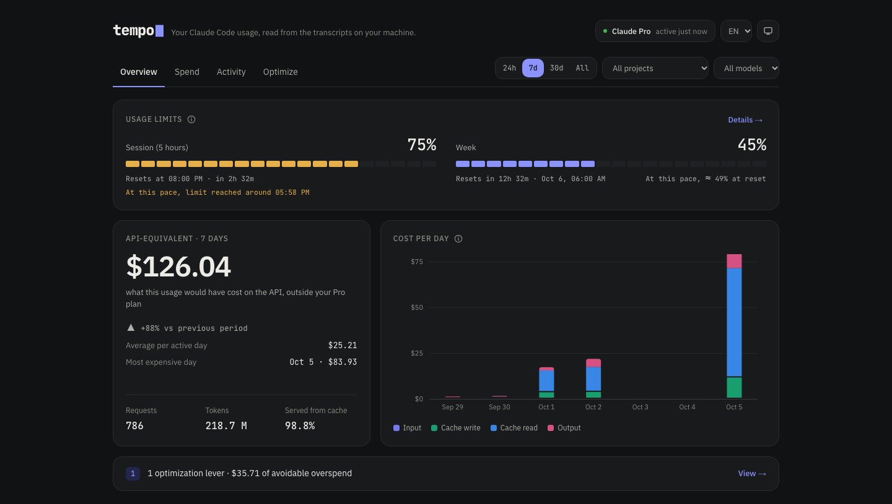
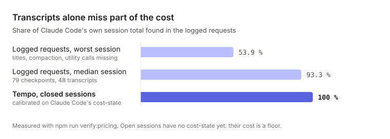
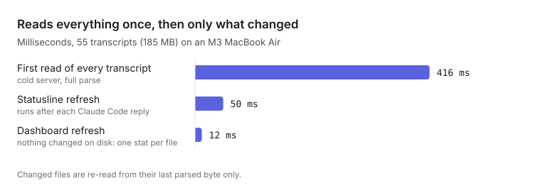

<div align="center">


### Know what your Claude Code sessions cost, and when you will hit your limits.

[](https://github.com/ethanbch/tempo/actions/workflows/ci.yml)
[](https://www.npmjs.com/package/tempo-dashboard)
[](LICENSE)
[](#nothing-leaves-your-machine)

</div>

---

A Claude Pro or Max subscription shows a usage bar, not what you used.
Anthropic's usage and cost APIs are reserved for organizations, so the only
record of your Claude Code usage is on your own disk: the transcripts Claude
Code writes after every reply. **Tempo reads them** and turns them into a
dashboard, a statusline and a one-line summary at the end of each session.

```sh
npx tempo-dashboard
```

Installs in 7 seconds, then opens in 1.5. `npx tempo-dashboard setup` adds
the statusline and your session and weekly limits.



<table>
<tr>
<td align="center" width="25%"><h3>100 %</h3>of Claude Code's own total,<br>on every closed session</td>
<td align="center" width="25%"><h3>12 ms</h3>to refresh the dashboard<br>when nothing changed</td>
<td align="center" width="25%"><h3>50 ms</h3>per statusline refresh,<br>after each reply</td>
<td align="center" width="25%"><h3>100 % local</h3>no account, no login,<br>no network call</td>
</tr>
</table>

## See where the cost goes

The overview fits on one screen: your session and weekly limits with their
pace, the API-equivalent cost against the previous period, and cost per day.
Three tabs hold the detail:

| Tab | What it answers |
| --- | --- |
| **Spend** | Which model, project, session, git branch and effort level cost the most |
| **Activity** | How your limits evolved, when the next one will be hit, when you use Claude |
| **Optimize** | What you can change: context repaid after a pause, cache invalidated mid-session, sessions grown too long |

Each git branch links to its pull request when the local history has the
merge commit. Tempo reads the local repository only; it calls neither GitHub
nor any other service.

## The cost is checked against Claude Code's own

Each logged request carries its token counts, priced with the public API
rates. That is not the whole bill: Claude Code also makes calls it never
logs, such as session titles, context compaction and utility tasks. At the
end of a session it writes its own total, and Tempo calibrates each session
on it.

<picture>
  <source media="(prefers-color-scheme: dark)" srcset="docs/charts/accuracy-dark.svg">
  
</picture>

| Cost source | Share of Claude Code's total |
| --- | --- |
| Logged requests, worst session | 53.9 % |
| Logged requests, median session | 93.3 % |
| **Tempo, closed sessions** (calibrated) | **100 %** |

The rate card is verified the same way: `npm run verify:pricing` replays
every session up to each of Claude Code's totals. Across 79 checkpoints in
48 transcripts, no session comes out above Claude Code's figure, which is
what a wrong rate or a double count would produce. A flat markup on the total
was considered and left out: spreading each session's factor over its own
requests keeps the charts, the filters and the total consistent.

## Limits before you hit them

The statusline saves the session and weekly percentages Claude Code receives
from Anthropic, and the dashboard charts them from the opening of each
window to its reset:

- **Pace and projection.** At your pace over the last hour (session) or the
  last 24 hours (week), Tempo says when you will hit the limit, or where you
  will be at the reset.
- **Estimated caps.** From your own history, "1 % ≈ $X" and the
  API-equivalent cost of a full window. Anthropic does not publish these.
- **Alerts** at 80 % and 95 %, as desktop notifications with the reset time,
  once per window.

## Fast, even with months of transcripts

<picture>
  <source media="(prefers-color-scheme: dark)" srcset="docs/charts/speed-dark.svg">
  
</picture>

| Step | Time |
| --- | --- |
| First read of 55 transcripts (185 MB) | 416 ms |
| Statusline refresh | 50 ms |
| Dashboard refresh, nothing changed | 12 ms |
| Open the dashboard, installed (`npx`) | 1.5 s |
| Install from scratch (`npx`, empty cache) | 7.0 s |

A refresh compares each file's size and modification time; a file that grew
is read again from its last parsed byte only. The server uses about 236 MB
of memory.

## Nothing leaves your machine

- Tempo reads the transcripts in `~/.claude/projects/`, your account details
  in `~/.claude.json`, and the limits its statusline saves in
  `~/.claude/tempo/`.
- The dashboard runs on `127.0.0.1`. The only network traffic is your
  browser talking to it.
- No account, no login, no telemetry. Nothing is sent to Anthropic, to
  Tempo's author, or to anyone else.

Tempo only covers **Claude Code**: conversations on claude.ai leave no local
trace.

## Table of contents

- [Getting started](#getting-started)
- [Command line](#command-line)
- [Languages](#languages)
- [Usage limit gauges and statusline](#usage-limit-gauges-and-statusline)
- [What the cost number means](#what-the-cost-number-means)
- [Refresh strategy](#refresh-strategy)
- [Optimization levers](#optimization-levers)
- [5-hour quota windows](#5-hour-quota-windows)
- [Project structure](#project-structure)
- [Configuration](#configuration)
- [Design notes](#design-notes)
- [Brand](#brand)
- [License](#license)

## Getting started

```bash
npx tempo-dashboard
```

This starts the dashboard on `127.0.0.1` and opens it in your browser. Tempo
finds the transcripts of every Claude Code session run on this machine.

To see your session and weekly limits, install the statusline and the session
summary once:

```bash
npx tempo-dashboard setup
```

To keep the `tempo` command around, install it globally:
`npm install -g tempo-dashboard`, then `tempo`.

## Command line

| Command | What it does |
| --- | --- |
| `tempo` | Start the dashboard and open it (`--port <n>`, `--no-open`) |
| `tempo status` | Limits with their pace, cost over 24 hours and 7 days, the current branch's cost, the lever to look at |
| `tempo doctor` | Check the installation and say what to fix |
| `tempo setup` | Install the statusline and the session summary (`--force` to replace another statusline, `--remove` to uninstall) |

The session summary is a Claude Code `SessionEnd` hook. When you quit a
session, it prints one line: duration, API-equivalent cost, requests, branch
and session limit. It prints nothing on `/clear`. Set
`TEMPO_SESSION_SUMMARY=off` to turn it off.

### From a clone

```bash
git clone https://github.com/ethanbch/tempo.git
cd tempo
npm install
npm run dev      # dashboard with hot reload, on http://localhost:3000
npm run build    # production server and the tempo command (node bin/tempo.mjs)
```

## Languages

Tempo speaks **English, French, Spanish and German**.

- **Dashboard**: the language follows your browser's preferences, and the
  EN / FR / ES / DE picker in the header switches it on the spot (the choice
  is remembered in a cookie). Numbers, dates and units follow the language's
  conventions.
- **Statusline and setup script**: they follow your terminal's language
  (`LANG`), or `TEMPO_LANG` if set, e.g.
  `"command": "TEMPO_LANG=fr node ~/.claude/tempo/bin/statusline.mjs"`.

Anything else falls back to English. Translations live in
`src/lib/i18n/messages/`; adding a language means adding a file there, which
TypeScript and the test suite check against the others key by key.

## Usage limit gauges and statusline

The dashboard can show the same percentages as Claude Code's `/usage`: how
much of your **5-hour session** and of your **week** you've used, and when
each one resets.

These numbers can't be derived from transcripts. Claude Code receives them
from Anthropic and passes them to its statusline. Tempo ships a statusline
script, `scripts/statusline.mjs`, that saves them to
`~/.claude/tempo/rate-limits.json` for the dashboard to read, and appends
every change to `rate-limits-history.jsonl` next to it. Tempo never touches
your credentials and still makes no network call.

### Setup

```bash
tempo setup
```

It copies the statusline and the session summary to `~/.claude/tempo/bin/`
and adds them to `~/.claude/settings.json` without touching your other
settings or other tools' hooks. Both keep working if you move or delete the
package. If another statusline is already configured, `tempo setup` asks
before replacing it and sets it aside; `tempo setup --remove` restores it.

Then send a message in any Claude Code session: the line appears at the
bottom of the terminal, and the dashboard's gauges fill in on its next
refresh. The figures only update while a Claude Code session is running;
the dashboard shows when the last reading was taken.

### Pace and projection

Each gauge charts the current window from its opening to its reset: the
readings as a solid line, and a dashed projection at your recent pace —
measured over the last hour for the session, the last 24 hours for the week.
The projection tells you either when you'll hit the limit, if that's before
the reset, or roughly where you'll be when it resets. Until the history goes
back far enough, the pace is the average since the window opened.

### Estimated caps

Anthropic doesn't publish what a Pro or Max limit amounts to. Tempo
estimates it from your own history: for each past window, the API-equivalent
cost of your Claude Code requests up to its highest reading, divided by the
percentage reached. The median across windows gives "1 % ≈ $X" and the
API-equivalent cost of a full window.

Two caveats. Usage on claude.ai or on another machine counts toward the
same limit but leaves no transcript here, so the real cap is then higher
than the estimate. And the limits weigh models differently, so the figure
shifts with your model mix. The estimate firms up as windows accumulate;
windows used under 5 % are ignored, being too noisy.

### Alerts

When a session or the week crosses **80 %** or **95 %**, the statusline
sends a desktop notification (macOS `osascript`, Linux `notify-send`) with
the reset time. Each threshold fires once per window. To change the
thresholds, or turn alerts off, set `TEMPO_ALERT_THRESHOLDS` in the
statusline command:

```json
"command": "TEMPO_ALERT_THRESHOLDS=70,90 node ~/.claude/tempo/bin/statusline.mjs"
```

(`TEMPO_ALERT_THRESHOLDS=off` disables them.)

### What the statusline shows

```
Opus 5.5 ◔ medium  ·  tempo ⎇ main ●  ·  ctx ▰▰▰▰▱▱▱▱ 52%  ·  5h ▰▱▱▱▱▱▱▱ 6% ↻ at 20:00  ·  7d ▰▰▰▱▱▱▱▱ 35% ↻ in 3d14h10m
```

| Block | Meaning |
| --- | --- |
| `Opus 5.5 ◔ medium` | Model and effort level (`○` low → `●` max); `⚡` when fast mode is on |
| `tempo ⎇ main ●` | Folder and git branch; `●` for uncommitted changes, `↑`/`↓` for commits ahead/behind the remote |
| `ctx` | Context window used — turns yellow at 60 %, red at 80 % |
| `5h` | 5-hour session used, and the time it resets (`at 20:00`); `· limit ~18:04` when the last hour's pace reaches the limit before the reset |
| `7d` | Week used, and the time left until it resets (`in 3d14h10m`) |

The words keep a reset *time* from being mistaken for a *duration*. In
French, the same line reads `↻ à 20h` and `7j … ↻ dans 3j14h10m`.

Session and week gauges turn yellow at 70 % and red at 90 %.

## What the cost number means

A Pro or Max subscription isn't billed per token. The number Tempo shows is
what the same usage would have cost at public API rates: it measures value
consumed, not an actual bill.

The calculation happens in two passes, because neither available source is
complete on its own:

1. **Visible requests.** Every assistant message in a transcript carries its
   own `usage`, priced against the rate card (`src/lib/pricing.ts`). Two
   traps live here: a single reply can span **multiple lines that all repeat
   the same `usage`** — the billing key is the API message id, not the
   line's — and a resumed session can rewrite its messages into a different
   file.
2. **Calibration.** Claude Code also makes billed calls it never logs: title
   generation, context compaction, utility tasks. At the end of a session it
   does write a `cost-state` record that totals everything, though. The
   ratio between the two gives a per-session factor — measured between 1.000
   and 1.857 over 79 checkpoints, median 1.072 — applied pro rata to each
   visible request.

Distributing the factor rather than adding a flat markup keeps the charts
consistent with the total, and keeps the period filter accurate. A session
still open has no `cost-state` yet: its factor is 1 and its cost is a floor.
The footer always shows what share of the total is calibrated.

### Tests

```bash
npm test
```

The suite covers transcript parsing (a reply split over several lines,
messages rewritten by a resumed session, lines still being written),
calibration and 5-hour windows, the limit projections and cap estimates,
language detection, per-language formatting and translation completeness, and
the statusline and setup scripts end to end, run against temporary files.

### Verifying the pricing

```bash
npm run verify:pricing
```

The script replays the messages preceding each `cost-state` and reports the
calibration factor obtained, rather than a delta — the delta is structural
and expected. It only fails if a factor falls outside the plausible range,
which would signal a wrong rate or double counting. Sessions with no utility
call yield a factor of 1.000 to four decimal places — the best evidence that
the rate card is accurate. Models absent from transcripts (Haiku utility
calls) are flagged as unreconcilable.

## Refresh strategy

The dashboard updates **every 30 seconds**, and on page load. No outbound
network call: the only request is the browser talking to your own local
server.

Since it runs in the background, three guardrails keep the cost in check:

- **Nothing fires while the tab isn't visible.** Verified under real
  conditions: tab backgrounded for 61s, zero requests. Coming back to the
  tab catches up — but only if the data is more than 30 seconds old,
  otherwise flipping between two tabs would trigger a burst.
- **Never two requests in flight at once**, and changing the time period
  cancels any refresh in progress.
- **A background error stays silent**: the previous render stays on screen.

On the server side, two levels of reuse. A disk fingerprint — path, size,
and modification time of each file — short-circuits everything when nothing
moved; that's the common case, and the work reduces to one `stat` per file.
When a transcript has grown, it's re-read **only from the last byte already
parsed**: transcripts only ever grow by appending, so an active session only
costs its new lines.

Measured on a 17 MB corpus (14 transcripts):

| Situation | Duration |
| --- | --- |
| First scan, full parse | 100 ms |
| Refresh with nothing new | 4 ms |
| 40 new lines, incremental read | 4 ms |

Without incremental reads, the third row would cost the same 100 ms as the
first: the gain is roughly **25×** once a session is active. Memory is
stable — 200 consecutive refreshes, i.e. 100 minutes of runtime, with no
monotonic growth.

Equality between incremental and full-parse reads is verified: truncating a
transcript by 300 lines and then replaying them, the result from incremental
appends matches a fresh process parsing everything from scratch.

## Optimization levers

The dashboard doesn't just count — it derives from the same requests what
you can actually act on, following the distinction from Anthropic's own cost
optimization guidance.

**Free wins** — they lower spend without touching quality:

- **Context repaid after a pause.** A cache entry expires after an hour of
  inactivity. Resuming a long session after a break rewrites its entire
  context at the write rate (2× the read price). Every cache write is
  attributed to its cause by replaying sessions: opening, normal growth,
  resume-after-expiry, model switch, effort switch.
- **Cache invalidated mid-session.** Switching model or effort level
  mid-session invalidates the cache and repays the entire history.
- **Context past the comfort threshold.** Every turn resends the whole
  history: a session's cost grows roughly as the square of the number of
  turns.
- **Sub-agent cost**, when there is any.

**Trade-offs** — they exchange cost for intelligence, and don't apply
automatically: effort level (with the share of output tokens spent on
reasoning) and model mix.

### Two honesty rules in the numbers

**A trade-off never shows a saving.** For these levers, the amount shown is
the *spend involved*, not a locked-in gain — the gain would be paid for in
quality, and nothing here can measure that loss. Only free wins show an
*avoidable overspend*.

**An avoidable overspend only counts the part that's actually avoidable.**
The long-context lever doesn't total the cost of every large-context
request — most of that context is the actual work. It only counts the
fraction re-read *beyond* the threshold, i.e. what systematic compaction
would have avoided. The line items also draw on disjoint token types (cache
writes for resumes and invalidations, cache reads for long context), so the
sum of the levers can never exceed the bill.

## 5-hour quota windows

Claude's quota recharges on a rolling window opened by the first request
after a pause. Tempo replays that rule over your history.

Anthropic doesn't publish a numeric token cap for Pro and Max, and making
one up would produce a false gauge. So this gauge reads **relative to your
busiest window** instead: a measurable comparison, rather than a percentage
of an unknown cap. For the actual percentage of your limits, see
[the usage limit gauges](#usage-limit-gauges-and-statusline).

## Project structure

| Path | Role |
| --- | --- |
| `src/lib/pricing.ts` | Rate card and cost calculation |
| `src/lib/scan.ts` | Streaming transcript reads, deduplication, in-memory cache |
| `src/lib/aggregate.ts` | Calibration and aggregations (day, model, project, window) |
| `src/lib/insights.ts` | Optimization levers: cache-write attribution, effort, models |
| `src/lib/series.ts` | Stable per-model color assignment |
| `src/lib/i18n/` | Languages, detection, and one message file per language |
| `src/lib/format.ts` | Numbers, dates and units, per language |
| `src/lib/limits.ts` | Usage limits: readings, pace projection, cap estimates |
| `src/components/charts/` | Hand-written SVG charts |
| `scripts/verify-pricing.ts` | Pricing verification against ground truth |
| `scripts/statusline.mjs` | Claude Code statusline: saves usage limits, keeps their history, sends alerts |
| `src/cli/` | The `tempo` command: start, status, doctor, setup, session summary |
| `src/lib/git.ts` | Branch and PR links, read from the local git history only |
| `scripts/build-cli.mjs` | Bundles the command into `dist/tempo.mjs`, with no dependencies |
| `tests/` | Vitest suite |

## Configuration

| Variable | Default | Purpose |
| --- | --- | --- |
| `CLAUDE_PROJECTS_PATH` | `~/.claude/projects` | Where transcripts are read from |
| `CLAUDE_CONFIG_PATH` | `~/.claude.json` | Where account info is read from |
| `TEMPO_LIMITS_PATH` | `~/.claude/tempo/rate-limits.json` | Where usage limits are saved and read, history alongside (set it for both the statusline and the server) |
| `TEMPO_ALERT_THRESHOLDS` | `80,95` | Statusline alert thresholds, in %, or `off` |
| `TEMPO_LANG` | terminal language | Language of the statusline, alerts and setup script: `en`, `fr`, `es`, `de` |
| `CLAUDE_SETTINGS_PATH` | `~/.claude/settings.json` | Settings file edited by `tempo setup` |
| `TEMPO_SESSION_SUMMARY` | on | `off` hides the line printed when a session ends |

## Design notes

The interface uses neutral surfaces, a single indigo accent, IBM Plex Sans
for text and JetBrains Mono for figures, times and paths, and segmented
gauges matching the statusline. Dark is the
reference theme; light gets the same care. Yellow and red are reserved for
limit alerts, which is why the accent is cool.

Every text colour holds at least 4.5:1 contrast on the surfaces it sits on, in
both themes. The categorical palette (indigo, aqua, blue, pink, then grey for
"other") and the indigo ramp were validated against the app's real surfaces in
both themes: lightness band, chroma floor, separation under color-blindness
simulation, and contrast. Two hues fall below 3:1 in light mode; direct
end-of-bar labels and the daily table (Spend tab) are the required
compensation, not an extra. Charts are hand-written
SVG to match brand specs — rounded data-side caps, a 2px gap between
adjoining segments, bars capped at 24px.

Effort level is an *ordered* scale, not a list of categories: it takes a
single-hue ramp whose steps rise with the level, rather than per-series
colors. The two steps closest to the ground are dropped — they exist to
represent "almost zero" on a continuous scale and don't hold the minimum
contrast required of an ordered scale.

## Brand

The logo is the name in JetBrains Mono ExtraBold followed by a block
cursor. `brand/` holds the exports: outlined SVGs (no font needed), PNGs from
16 to 2048 px, and a one-page PDF sheet with variants, colours, clear space
and misuse. JetBrains Mono is under the SIL Open Font License, which allows
its use in a logo.

## Tech stack

Next.js · React · TypeScript · Tailwind CSS · hand-written SVG charts (no
charting library).

## License

[MIT](LICENSE)
